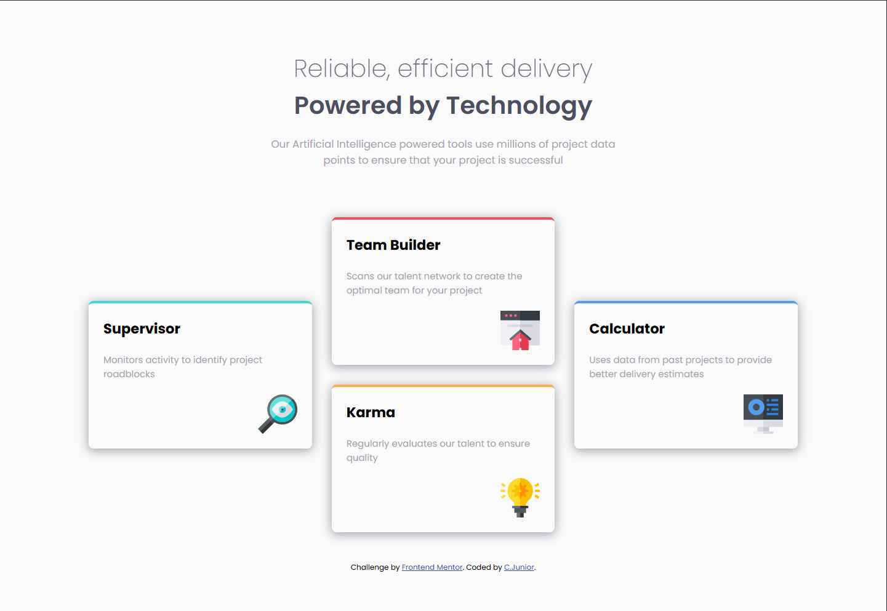

# Frontend Mentor - Four card feature section solution

This is a solution to the [Four card feature section challenge on Frontend Mentor](https://www.frontendmentor.io/challenges/four-card-feature-section-weK1eFYK). Frontend Mentor challenges help you improve your coding skills by building realistic projects.


## Table of contents

- [Overview](#overview)
  - [The challenge](#the-challenge)
  - [Screenshot](#screenshot)
  - [Links](#links)
- [My process](#my-process)
  - [Built with](#built-with)
  - [What I learned](#what-i-learned)
  - [Continued development](#continued-development)
  - [Useful resources](#useful-resources)
- [Author](#author)
- [Acknowledgments](#acknowledgments)

## Overview

### The challenge

Users should be able to:

- View the optimal layout for the site depending on their device's screen size

### Screenshot

Media screens: 375px


Media screens: 1440px


### Links

- Solution URL: [Frontend Mentor](https://www.frontendmentor.io/solutions/four-card-feature-section-master-Gz5tBG9AcR)
- Live Site URL: [Github Pages](https://clar-junior.github.io/four-card-feature-section-master/)

## My process

### Built with

- Semantic HTML5 markup
- CSS custom properties
- Flexbox
- CSS Grid
- Mobile-first workflow

### What I learned

I've learned so much thing about css grid, mainly about positionings.

```css
.card-1:nth-of-type(1) {
		grid-row: 1 / 3;
	}
	.card-2:nth-of-type(2) {
		grid-column: 2 / 3;
		grid-row: 1;
	}
	.card-3:nth-of-type(3) {
		grid-column: 2 / 3;
		grid-row: 2;
	}
	.card-4:nth-of-type(4) {
		grid-column: 3 / 4;
		grid-row: 1 / 3;
	}
```

### Continued development

Learn:

- [Tailwind](https://tailwindcss.com/)
- [Sass](https://sass-lang.com/)
- [Less](https://lesscss.org/)

### Useful resources

- [CSS Grid](https://www.youtube.com/watch?v=0xMQfnTU6oo) - This helped me understand how css grid works.

## Author

- Frontend Mentor - [@Clar-Junior](https://www.frontendmentor.io/profile/Clar-Junior)

## Acknowledgments

My acknowledgements to the Youtube channel [Traversy Media](https://www.youtube.com/@TraversyMedia)  by various teachings and excellent didactic.

